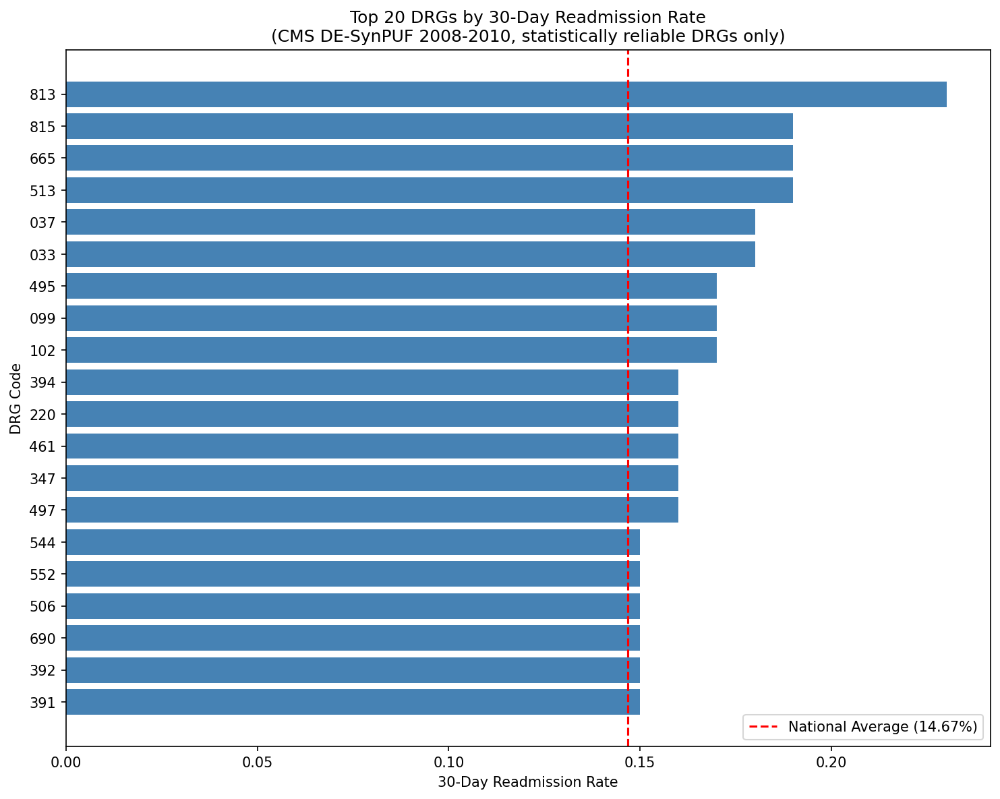
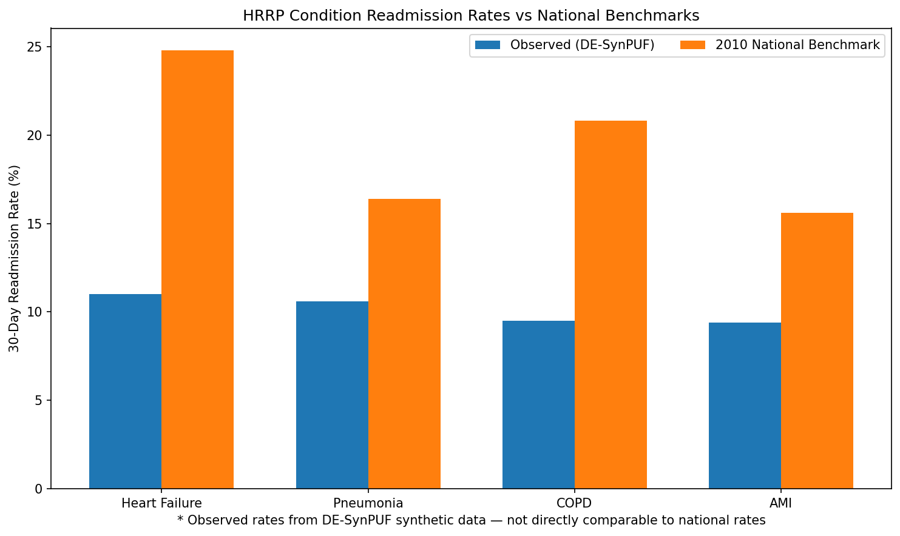

# 30-Day Readmission Analysis — CMS Medicare Claims (DE-SynPUF)

SQL-based analysis of 66,773 Medicare inpatient claims identifying 30-day readmission patterns by diagnosis, with data quality auditing, censoring correction, and comparison against the national readmission benchmark.

## Research Questions

Which diagnosis groups drive 30-day readmissions in this Medicare
population, and how do their rates compare to the national benchmark once low-volume and censored discharges are handled correctly?

How do the readmission rates of the target Hospital Readmissions Reduction Program (HRRP) conditions/procedures within this dataset compare to national averages?

## Key Findings

- Overall 30-day readmission rate: **9.65%** across 66,449 index discharges
- National all-cause benchmark: **14.67%** (Definitive Healthcare, 2025, sourced from CMS data)
- Highest readmission rates: 
**Coagulation Disorders (DRG 813)** at 22.8%, 
**Prostatectomy with MCC (DRG 665)** at 19.5%,
**Hand or Wrist Proc, Except Major Thumb or Joint Proc w CC/MCC (DRG 513)** at 18.8%,
**Reticuloendothelial & Immunity Disorders (DRG 815)** at 18.6%, and 
**Extracranial Procedures w MCC (DRG 037)** at 18.2%
  
- Notable: the highest-rate DRGs span hematologic, urologic, orthopedic, 
  immunologic, and neurologic conditions — no cardiac DRGs appear in the 
  top 5, despite cardiac conditions being the primary focus of CMS HRRP readmission reduction programs.

-All diagnosis based HRRP conditions have readmission rates significantly lower than published baselines. 
| Condition | Cited Readmission Rate | DE-SynPUF rate | Difference |
|-----------|------------------------|----------------|------------|
| Heart Failure | 24.8 | 11.0 | -13.8 | 
| Pneumonia | 16.4 | 10.6 | -5.8 |
| COPD | 20.8 | 9.5 | -11.3 |
| AMI | 15.6 | 9.4 | -6.2 |
*Observed rates are crude (unadjusted); national benchmarks are risk-standardized. Synthetic data limitations apply — see Limitations section.*

  

## Methods

- **Readmission flagging:** LEAD() window functions over per-patient
  discharge sequences (CTE-structured), computed two ways — including and
  excluding 1-day gaps — with the tradeoffs documented in query comments
- **Censoring correction:** Excluded 324 discharges (0.49%) within 30
  days of the observation window end, since their readmission status is
  unobservable; naive inclusion understates the true rate
- **Statistical reliability filter:** DRGs retained only where n×p ≥ 10 and
  n×(1−p) ≥ 10 (CLT proportions check), preventing unstable rates from
  low-volume diagnosis groups
- **Rate calculation:** Conditional aggregation (AVG of CASE WHEN) by DRG

## Analyses
- 30-day readmission analysis (2 versions — with and without single day readmissions, with discussion of tradeoffs in query comments)
- `readmission_analysis.ipynb` — Top 20 readmission rates by DRG with national average comparison
- `hrrp_condition_readmission_analysis.ipynb` — Observed 30-day readmission rates for 4 HRRP conditions (AMI, Heart Failure, Pneumonia, COPD) compared against 2010 national benchmarks. All observed rates substantially below benchmarks, consistent with synthetic data limitations.

## Data Quality

All data decisions are documented in [`data_quality_log.md`](data_quality_log.md),
including handling of dates stored as YYYYMMDD strings, blank deductible
amounts (3.26% loaded as 0), and blank utilization day counts (3.5%
loaded as 0), with the reasoning for each decision.

## Limitations

- DE-SynPUF is synthetic: distributions approximate real Medicare claims
  but individual-level patterns are artificial; rates here characterize
  the method, not the true population
- Dates stored as YYYYMMDD strings, not DATE type. Requires STR_TO_DATE() conversion before any date math. 
- Readmission defined as any-cause inpatient return within 30 days; no
  transfer or planned-readmission exclusions (unlike CMS HRRP methodology)
- Results of high-utilizer flagging reveal that multiple diagnosis and procedure codes in DE-SynPUF do not reflect believable clinical patterns — consistent with synthetic data limitations. Predictive modeling using diagnosis-procedure code clusters should be reserved for real claims data.  

## Data Source

CMS 2008-2010 DE-SynPUF synthetic Medicare claims files. 66,773 inpatient claims rows loaded (Sample 1).

**File Names:**
- DE1_0_2008_to_2010_Inpatient_Claims_Sample_1.csv
- DE1_0_2008_to_2010_Outpatient_Claims_Sample_1.csv

**Data Source:** 
https://www.cms.gov/data-research/statistics-trends-and-reports/medicare-claims-synthetic-public-use-files/cms-2008-2010-data-entrepreneurs-synthetic-public-use-file-de-synpuf

## Repository Structure

- `queries/` — SQL for table setup, data quality checks, and analysis
- `analysis/` — Jupyter notebooks pulling SQL results for visualization
  (`readmission_analysis.ipynb`)
- `data_quality_log.md` — running log of findings and decisions
- `images/` — exported figures

## Roadmap
- CABG and THA/TKA condition mapping via procedure codes (ICD-9 PRCDR fields)
- PMPM approximation and high-utilizer flagging
- BI dashboard of readmission results
- BigQuery extension on real CMS public datasets

## References

Definitive Healthcare. (2025, March). *Average hospital readmission rate by state*. 
Data originally sourced from CMS. 
https://www.definitivehc.com/resources/healthcare-insights/average-hospital-readmission-state

Centers for Medicare & Medicaid Services. (n.d.). *Medicare fee-for-service DRG descriptions*. 
U.S. Department of Health & Human Services. 
https://www.cms.gov/research-statistics-data-and-systems/statistics-trends-and-reports/medicarefeeforsvcpartsab/downloads/drgdesc19.pdf

Centers for Medicare & Medicaid Services. (n.d.). *Hospital Readmissions Reduction Program (HRRP)*. U.S. Department of Health & Human Services. https://www.cms.gov/medicare/quality/value-based-programs/hospital-readmissions

Rachoin, J.-S., Hunter, K., Varallo, J., & Cerceo, E. (2024). Impact of time 
from discharge to readmission on outcomes: an observational study from the US 
National Readmission Database. *BMJ Open, 14*(8), e085466. 
https://doi.org/10.1136/bmjopen-2024-085466

## Author

Douglas Jaser — MS, Data Science (Illinois Institute of Technology)
github.com/Djaser23

