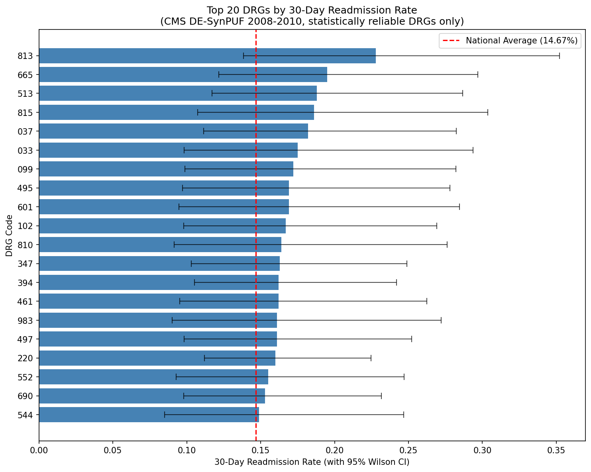
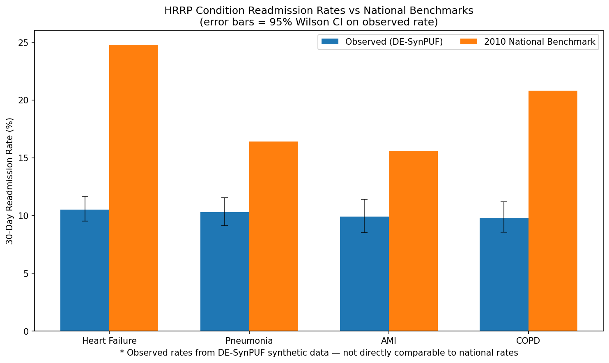

# 30-Day Readmission Analysis — CMS Medicare Claims (DE-SynPUF)

SQL-based analysis of 66,773 Medicare inpatient claims identifying 30-day readmission patterns by diagnosis, with data quality auditing, censoring correction, and comparison against a national readmission benchmark.

## Research Questions

Which diagnosis groups drive 30-day readmissions in this Medicare
population, and how do their rates compare to the national benchmark once low-volume and censored discharges are handled correctly?

How do the readmission rates of the target Hospital Readmissions Reduction Program (HRRP) conditions/procedures within this dataset compare to national averages?

## Key Findings

- Overall 30-day readmission rate: **9.67%** across 66,449 index discharges (95% CI 9.45–9.89%, normal approximation)
- National all-cause benchmark: **14.67%** (Definitive Healthcare, 2025; sampling methodology not disclosed — see Limitations)
- Highest readmission rates: 
**Coagulation Disorders (DRG 813)** at 22.8%, 
**Prostatectomy with MCC (DRG 665)** at 19.5%,
**Hand or Wrist Proc, Except Major Thumb or Joint Proc w CC/MCC (DRG 513)** at 18.8%,
**Reticuloendothelial & Immunity Disorders (DRG 815)** at 18.6%, and 
**Extracranial Procedures w MCC (DRG 037)** at 18.2%
- Note: Given small DRG-level sample sizes (n=57-80 for top-ranked DRGs),
  95% confidence intervals for all top 5 DRGs overlap the national
  benchmark (14.67%) — meaning none are statistically distinguishable
  from the national average at this sample size. See uncertainty
  quantification in Methods.
  
- Notable: the highest-rate DRGs span hematologic, urologic, orthopedic, 
  immunologic, and neurologic conditions — no cardiac DRGs appear in the 
  top 5, despite cardiac conditions being the primary focus of CMS HRRP readmission reduction programs.

- Note: Unlike the DRG-level result above, none of the 4 HRRP conditions' 95% confidence intervals overlap their national benchmark — even the upper CI bound stays well below benchmark in every case (e.g. Heart Failure's upper bound of ~11.7% vs. a 24.8% benchmark). Given the much larger per-condition sample sizes (n=1,633–3,132 vs. n=57–80 for the top DRGs), these CIs are roughly 6–10x narrower than the DRG-level CIs above despite using the same underlying claims data — a large enough margin that CI non-overlap serves as a reasonable informal proxy for a real difference, though not a substitute for a formal two-sample test. See uncertainty quantification in Methods.  

For all 4 HRRP conditions, the observed rate's 95% CI lies entirely below the published benchmark. This is an informal comparison, not a formal test.

| Condition | Cited Readmission Rate | DE-SynPUF rate | 95% CI | Difference (pp) |
|-----------|------------------------|----------------|--------|------------|
| Heart Failure | 24.8% | 10.5% | 9.51–11.66% | -14.3 |
| Pneumonia | 16.4% | 10.3% | 9.14–11.55% | -6.1 |
| COPD | 20.8% | 9.8% | 8.58–11.17% | -11.0 |
| AMI | 15.6% | 9.9% | 8.51–11.40% | -5.7 |

*Observed rates are from synthetic data; national benchmark rates are from Rachoin et al. (2024) for 2010. Synthetic data limitations apply — see Limitations section.*

## Synthesis: Reconciling DRG-Level and HRRP-Level Findings
The two headline findings above appear to point in different directions: the top 5 DRGs by readmission rate are non-cardiac (hematologic, urologic, orthopedic, immunologic, neurologic), while the four HRRP-tracked conditions — the specific diagnoses CMS's readmission reduction program is built around — all show 95% CIs lying entirely below national benchmarks (an informal comparison, not a formal test). Read at face value, this suggests HRRP's named conditions may not be the actual readmission drivers in this population. That reading should be treated as a hypothesis, not a conclusion. The DRG-level result is undercut by its own uncertainty: all five top-DRG 95% confidence intervals overlap the 14.67% national benchmark (see Key Findings), meaning none are statistically distinguishable from average at this sample size (n=57–80). The HRRP-level result is on firmer ground — CIs are 6–10x narrower with no overlap — so this isn't two weak signals canceling out, but a fragile small-n signal against a solid one. The remaining gap: the two benchmarks aren't directly comparable — DRG-level checks against an all-cause crude rate (Definitive Healthcare, 2025), HRRP-level against condition-specific crude rates (Rachoin et al., 2024)

Given that mismatch and the synthetic data, this analysis still can't confidently claim HRRP's targeted conditions are misaligned with this population's risk — but the pattern is better supported than the DRG-level result alone suggests, and worth checking against real claims data in V2.

## Decision Implications
**Note: These implications are directional only — DE-SynPUF synthetic data does not support production-level conclusions. V2 on real CMS Medicare data via BigQuery is planned.**

If applied to real claims data, this analysis would enable:
- Care management targeting — high-utilizer flagging identifies the top 5% of admitted members by claims per member per year, enabling health plans to prioritize outreach and case management resources toward the highest-cost patients
- Readmission prevention — 30-day readmission rates by DRG and HRRP condition identify which diagnosis groups carry disproportionate readmission risk, informing discharge planning and post-acute follow-up protocols
- Cost trend monitoring — query 12 gives average monthly inpatient cost per
admitted patient, not a true PMPM. 12b builds a true PMPM using
BENE_HI_CVRAGE_TOT_MONS as the member-months denominator (see Limitations
for the zero-coverage caveat).
- HRRP Benchmark monitoring: Tracking of CMS Hospital Readmissions Reduction Program (HRRP) marked diagnosis codes against published rates informing how the cohort is performing against the known population.

  

## Methods

- **Process note:** This analysis began as exploratory work to build
  familiarity with claims data structure, and the two research questions above emerged from that exploration rather than being specified in advance. Going forward, I plan to state a clear hypothesis before querying, even in early exploratory work.
- **Readmission flagging:** LEAD() window functions over per-patient
  discharge sequences (CTE-structured), computed two ways — including and
  excluding 1-day gaps — with the tradeoffs documented in query comments
- **Censoring correction:** Excluded 324 discharges (0.49%) within 30
  days of the observation window end, since their readmission status is
  unobservable; naive inclusion understates the true rate
- **Statistical reliability filter:** DRGs retained only where n×p ≥ 10 and
  n×(1−p) ≥ 10 (i.e., at least 10 readmissions and 10 non-readmissions; a
  normal-approximation rule of thumb), preventing unstable rates from
  low-volume diagnosis groups

- **HRRP condition mapping:** ICD-9 diagnosis codes mapped to condition categories
(AMI, Heart Failure, Pneumonia, COPD) using ICD9_DGNS_CD_1 (principal discharge
diagnosis), not admitting diagnosis. This field choice follows Suter et al.
(2014) for AMI, Heart Failure, and Pneumonia; that study does not address
COPD, so the same field is applied to COPD by extension, without separate
citation support. Rates were originally computed using admitting diagnosis;
recomputing with principal diagnosis shifted rates by ≤0.5 percentage points
across all four conditions. The ICD-9 prefix mapping itself — one leading
prefix per condition — is a simplification not validated against official
CMS specifications; see Limitations.

- **Rate calculation:** Conditional aggregation (AVG of CASE WHEN) by DRG

- **Uncertainty quantification:** 95% Wilson confidence intervals computed for each DRG's readmission rate and, separately, for each of the 4 HRRP conditions (statsmodels.stats.proportion_confint), since point estimates alone can't distinguish a real difference from sampling noise. The HRRP-condition CIs benefit from far larger per-group sample sizes than the DRG-level CIs (n=1,633–3,132 vs. n=57–80), producing intervals roughly 6–10x narrower and correspondingly more statistically decisive comparisons against benchmark.  

## Setup

1. Download the CMS DE-SynPUF Inpatient Claims Sample 1 file (2008-2010) from the
   Data Source link below.
2. Place the CSV in `data/raw/` at the repo root (create the folder if it doesn't exist).
3. Run `01_setup_table.sql` from the repo root — it creates the `claims_practice` database and `inpatient_claims` table, then loads the CSV via `LOAD DATA LOCAL INFILE`.
4. Before running any other query file, set your MySQL connection's default database to `claims_practice` — no query file sets this itself.

## Analyses
- `03a_los_by_drg.sql` / `03b_los_by_drg.sql` — Row-level and DRG-aggregated length of stay (exploratory; not carried into the final narrative)
- `04_patient_admission_rank.sql` — Whole-period admission ranking by patient (exploratory precursor to the year-partitioned high-utilizer methodology in `13a`/`13b`)
- `05_patient_readmission_analysis.sql` — 30-day readmission flagging, computed 2 ways (with and without single-day gaps); tradeoffs discussed in query comments
- `06_readmission_by_drg.sql` — Readmission rates by DRG (single-day gaps included); minimum-count reliability filter applied (at least 10 readmissions and 10 non-readmissions)
- `07_censoring_analysis.sql` — Quantifies censored discharges (324, 0.49%)
  near the observation window end
- `08_overall_readmission_rate.sql` — Overall 30-day readmission rate (9.67%,
  single-day gaps included) across index discharges
- `09_icd9_frequency_by_hrrp_condition.sql` (validates ICD-9-to-condition
  mapping logic, 50-row preview) / `11_hrrp_condition_readmission_rates.sql` —
  applies the mapping across the full dataset and computes readmission rates for 4 HRRP conditions vs. national benchmarks
- `10_readmission_rate_by_icd9.sql` — Readmission rates by admitting ICD-9 diagnosis code (`ADMTNG_ICD9_DGNS_CD`), chosen over principal diagnosis for its clinical availability early in the patient encounter — see file header for rationale and predictive-modeling implications. Uses the same minimum-count reliability filter (at least 10 readmissions and 10 non-readmissions) as `06`, computed from a raw `readmission_count` (see`10_readmission_rate_by_icd9_validation.sql` for fix verification: 7 diagnosis codes recovered, no false positives)
- `10b_readmission_rate_by_icd9_principal.sql` — Companion to `10_readmission_rate_by_icd9.sql`, using principal diagnosis (`ICD9_DGNS_CD_1`) instead of admitting diagnosis. Built to compare two distinct, both-valid framings — early clinical accessibility (10) vs. CMS-standard discharge basis (10b) — rather than treating one as a fix for the other. 
Uses the same minimum-count reliability filter (at least 10 readmissions and 10 non-readmissions) as `10/06`.
- `13a_high_utilizer_flagging.sql` / `13b_high_utilizer_first_claim.sql` — Top 5% utilizer flagging by claims volume, full and first-claim-only variants (validated in `13a_high_utilizer_flagging_validation.sql`)  
- `readmission_analysis.ipynb` — Top 20 readmission rates by DRG with 95%
  Wilson confidence intervals and national average comparison
- `hrrp_condition_readmission_analysis.ipynb` — Observed 30-day readmission rates for 4 HRRP conditions (AMI, Heart Failure, Pneumonia, COPD) compared against 2010 national benchmarks. All observed rates' 95% CIs lie entirely below benchmarks (informal comparison, not a formal test), consistent with synthetic data limitations.
- `12_pmpm_analysis.sql` — average monthly inpatient cost per admitted patient by year (not a true PMPM — see Limitations)
- `12b_true_pmpm.sql` — True PMPM calculation using BENE_HI_CVRAGE_TOT_MONS as the member-months denominator. Fixed 09/27/26 to include zero-coverage members (see Limitations and data_quality_log.md); corrected figures: 198.77 (2008), 190.45 (2009), 105.09 (2010).
- `12c_pmpm_validation.sql` — Independent validation of `12b` via a structurally different query path; originally surfaced the zero-coverage exclusion gap (~$486K in 2010 alone), fixed 09/27/26 (see `12b`'s BUG HISTORY note and data_quality_log.md)
- `12d_coverage_claims_contradiction_check.sql` — Tests whether zero-coverage member-years have paid inpatient claims; see Limitations

## Data Quality

All data decisions are documented in [`data_quality_log.md`](data_quality_log.md),
including handling of dates stored as YYYYMMDD strings, blank deductible
amounts (3.26% loaded as 0), and blank utilization day counts (3.5%
loaded as 0), with the reasoning for each decision.

## Limitations

- DE-SynPUF is synthetic: distributions approximate real Medicare claims but individual-level patterns are artificial; rates here characterize the method, not the true population
- Dates stored as YYYYMMDD strings, not DATE type. Requires STR_TO_DATE() conversion before any date math. 
- Readmission defined as any-cause inpatient return within 30 days; no
  transfer or planned-readmission exclusions (unlike CMS HRRP methodology)
- National benchmark (Definitive Healthcare, 2025) is drawn from a subset (4,100 of ~9,000 US hospitals) in a commercial dataset; the source article does not describe the sampling methodology, so geographic or other representativeness cannot be confirmed.  
- Results of high-utilizer flagging reveal that multiple diagnosis and procedure codes in DE-SynPUF do not reflect believable clinical patterns — consistent with synthetic data limitations. Predictive modeling using diagnosis-procedure code clusters should be reserved for real claims data.
- True PMPM (`12b_true_pmpm.sql`) originally used `BENE_HI_CVRAGE_TOT_MONS` as the member-months denominator with a `HAVING member_months > 0` filter that silently excluded
zero-coverage members from both numerator and denominator, based on a flawed belief that those rows were deaths. Only 307 of 18,854 zero-coverage rows (1.6%) actually have a death date. The filter was removed on 09/27/26 (see `data_quality_log.md`); corrected PMPM figures are 198.77 (2008), 190.45 (2009), 105.09 (2010). Root cause of the zero-coverage population itself is still open (see `02b`, `02c`, `12d_coverage_claims_contradiction_check.sql`). Zero-coverage member-years contribute claims (~$4.76M across 2008–2010, per `12d_coverage_claims_contradiction_check.sql`) but 0 months to the denominator, which inflates PMPM somewhat.
- The high-utilizer flagging filter in files 13a_high_utilizer_flagging and 13b_high_utilizer_first_claim utilizes the ROW_NUMBER() window function instead of PERCENT_RANK() in order to deterministically produce approximately 5% of high utilizers per year. Due to this methodology, ties at the cutoff boundary are broken by patient ID, meaning members with identical claim counts near the threshold may be arbitrarily included or excluded.
- The HRRP condition mapping (`09_icd9_frequency_by_hrrp_condition.sql`, `11_hrrp_condition_readmission_rates.sql`) uses a single leading ICD-9 prefix per condition (e.g. `428%` for Heart Failure) as a simplified proxy. This simplification has not been validated against any official CMS specification of condition-defining diagnosis codes.
- The principal-diagnosis field choice for HRRP condition mapping is sourced to Suter et al. (2014) for AMI, Heart Failure, and Pneumonia only; that study does not cover COPD, so the same field choice is applied to COPD by extension, without separate citation support.

## Data Source

CMS 2008-2010 DE-SynPUF synthetic Medicare claims files. 66,773 inpatient claims rows loaded (Sample 1).

**File Names:**
- DE1_0_2008_to_2010_Inpatient_Claims_Sample_1.csv
- DE1_0_2008_to_2010_Outpatient_Claims_Sample_1.csv

**Data Source:** 
https://www.cms.gov/data-research/statistics-trends-and-reports/medicare-claims-synthetic-public-use-files/cms-2008-2010-data-entrepreneurs-synthetic-public-use-file-de-synpuf

## Repository Structure

- `queries/` — SQL for table setup, data quality checks, and analysis
- `notebooks/` — Jupyter notebooks pulling SQL results for visualization
  (`readmission_analysis.ipynb`, `hrrp_condition_readmission_analysis.ipynb`)
- `data_quality_log.md` — running log of findings and decisions
- `images/` — exported figures

## Roadmap
- Resolve root cause of the zero-coverage member-years driving the true-PMPM exclusion (see Limitations, `02b`/`02c`/`12d`)
- CABG and THA/TKA condition mapping via procedure codes (ICD-9 PRCDR fields)
- BI dashboard of readmission results
- BigQuery extension on real CMS public datasets

## References

Definitive Healthcare. (2025, March). *Average hospital readmission rate by state*. 
Data originally sourced from CMS. 
https://www.definitivehc.com/resources/healthcare-insights/average-hospital-readmission-state

Centers for Medicare & Medicaid Services. (n.d.). *Medicare fee-for-service DRG descriptions*. 
U.S. Department of Health & Human Services. 
https://www.cms.gov/research-statistics-data-and-systems/statistics-trends-and-reports/medicarefeeforsvcpartsab/downloads/drgdesc19.pdf

Centers for Medicare & Medicaid Services. (n.d.). *Hospital Readmissions Reduction Program (HRRP)*. U.S. Department of Health & Human Services. https://www.cms.gov/medicare/quality/value-based-programs/hospital-readmissions

Rachoin, J.-S., Hunter, K., Varallo, J., & Cerceo, E. (2024). Impact of time from discharge to readmission on outcomes: an observational study from the US National Readmission Database. *BMJ Open, 14*(8), e085466. 
https://doi.org/10.1136/bmjopen-2024-085466

Suter LG, Li SX, Grady JN, Lin Z, Wang Y, Bhat KR, Turkmani D, Spivack SB, Lindenauer PK, Merrill AR, Drye EE, Krumholz HM, Bernheim SM. National patterns of risk-standardized mortality and readmission after hospitalization for acute 
myocardial infarction, heart failure, and pneumonia: update on publicly reported outcomes measures based on the 2013 release. J Gen Intern Med. 2014 Oct;29(10):1333-40. doi: 10.1007/s11606-014-2862-5. PMID: 24825244; PMCID: PMC4175654.

## Author

Douglas Jaser — MS, Data Science (Illinois Institute of Technology)
github.com/Djaser23

